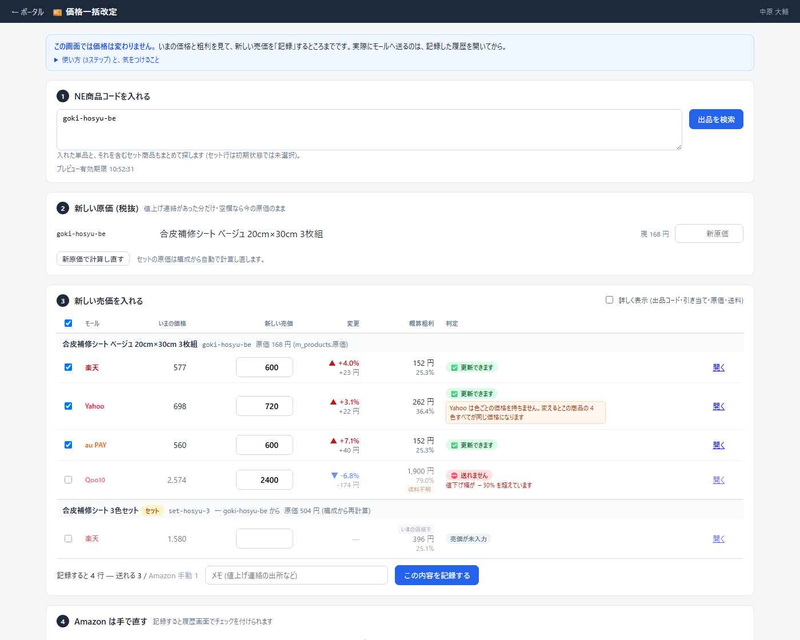
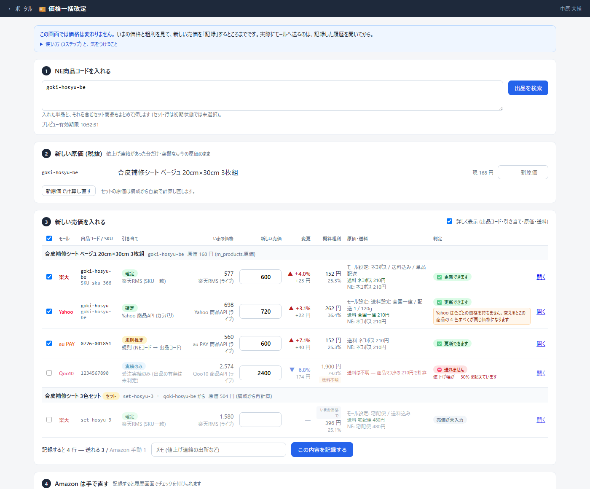
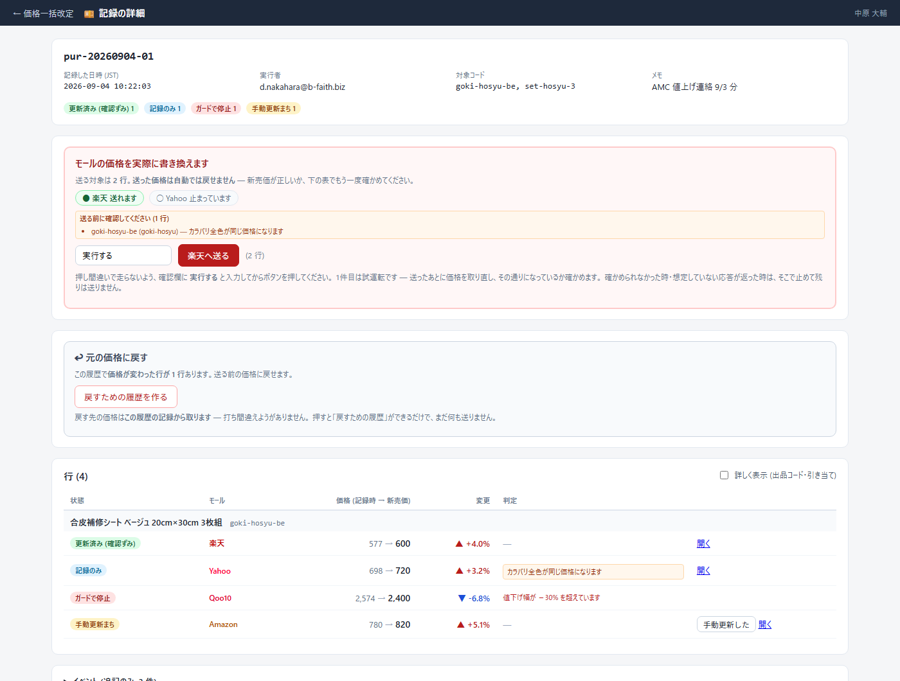

# 価格一括改定ツール 操作マニュアル

<https://bfaith-portal.onrender.com/apps/price-update>

仕入先から値上げの連絡が来たときに、**モールの管理画面を4つ開かずに**売価を直すための道具。
画面は「①記録する」→「②送る」の2段階に分かれている。**送るのは②だけ**で、①では何も変わらない。

- 対象モール = **楽天 / Yahoo / au PAY / Qoo10**
- Amazon は対象外 (別ツールがあるため)。チェックリストとしてだけ記録される
- 開発者向けの説明 (環境変数・ガードの中身) = [`apps/price-update/README.md`](../../apps/price-update/README.md)

---

## 使う前に

| いること | どこで決まるか |
| --- | --- |
| 画面を見る権限 | `/admin` の画面権限 `price-update` |
| 実行する権限 | `PRICE_UPDATE_EXECUTORS` (メールの名簿)。**管理者でも名簿に無ければ送れない** |
| そのモールへ送ってよいか | `PRICE_UPDATE_RAKUTEN_ENABLED` / `PRICE_UPDATE_YAHOO_ENABLED` など。**未設定なら1件も送らない** |

**急いで止めたいとき** = 上のモール別のスイッチを消す (Render の環境変数)。これが一番速い。

---

## ① 記録する画面

上の青い帯のとおり、**この画面では価格は変わらない**。
`使い方 (3ステップ) と、気をつけること` を開くと、同じ説明が画面の中にもある。

### 1. NE商品コードを入れる

改行・カンマ・空白のどれで区切ってもよい (最大20コード)。
**入れた単品を含むセット商品も自動で出てくる** (セットの行は最初チェックが外れている)。

「出品を検索」を押すと各モールのAPIに問い合わせる。**数十秒かかる**ことがある。

### 2. 新しい原価 (税抜)

値上げ連絡が来た商品だけ入れる。空欄なら今の原価のまま。
入れたら「新原価で計算し直す」を押す — **セットの原価も構成から計算し直される**。

### 3. 新しい売価を入れる

商品ごとにまとまって、その下にモール別の行が並ぶ。**同じ商品の楽天とYahooが縦に並ぶので、
値付けのばらつきに気づける** (実測で 121円 差が見つかったことがある)。

| 列 | 読み方 |
| --- | --- |
| いまの価格 | モールから今この瞬間に取ってきた売価 |
| 新しい売価 | ここに入れる。入れるたびに右の3列が計算し直される |
| 変更 | ▲ = 値上げ / ▼ = 値下げ。率と金額 |
| 概算粗利 | 新売価での粗利。**売価が空の間は「いまの価格で」** の粗利 (札が付く) |
| 判定 | ✅ 更新できます / ⚠️ 注意 / ⛔ 送れません / 売価が未入力 (灰色 = まだ入れていないだけ) |

- **⛔ が付いた行は、記録しても送られない**。0円・小数・−30%超の値下げ・+10万円超の値上げ・原価割れなど
- **⚠️ の注意書きはそのまま読むこと**。例: 「Yahoo は色ごとの価格を持ちません」= 1色のつもりでも**全色が同じ価格になる**
- **送料不明** の札が付いた粗利は当てになりません (商品マスタの送料で計算している)
- 右上の **詳しく表示** で、出品コード・引き当ての確からしさ・原価・送料の内訳が出る (粗利が合わないときはここ)
- いちばん左上のチェックボックスは **「送れる単品の行をすべて選ぶ」**。**セットの行と ⛔ の行は選ばれない**
  (外すときは全部外れる)

左下に **「記録すると N 行 — 送れる X / ⛔ Y / 売価が未入力 Z / Amazon 手動 W」** が出る。
記録API と同じ数え方なので、この N がそのまま履歴の行数になる (**Amazon の行は選ばなくても足される**)。
ここを見てから「この内容を記録する」。
メモには**値上げ連絡の出所**を書いておくと、あとで履歴を見たときに分かる。

---

## ② 送る画面 (記録の詳細)

記録すると自動でこの画面に移る。あとからは「これまでの記録」→「開く →」で戻れる。

上のカードに **状態の内訳**が出る。行を数えなくても、この履歴がどこまで進んだか分かる。

### 送る手順

1. 赤い枠の中の丸印で、**どのモールが送れる状態か**を確認する (`● 楽天 送れます` / `○ Yahoo 止まっています`)
2. **「送る前に確認してください」の注意書きを読む** (全色つられて変わる行など)
3. 下の表で新売価をもう一度確かめる
4. 確認欄に **実行する** と入力 → ボタンが押せるようになる → 押す

**1件目は試運転**。送ったあとに価格を取り直し、その通りになっているか確かめる。
確かめられなかったとき・想定しない応答が返ったときは、**そこで止めて残りは送らない**。
2件続けて失敗したときも残りを止める。

### 送ったあと

| 出た言葉 | 意味 | やること |
| --- | --- | --- |
| 更新済み (確認ずみ) | 送って、取り直して、その通りだった | なし |
| 同じ価格だった | もともと同じ価格 | なし |
| 価格が違うので送らず | 記録したときの価格と、今の価格が違う | 誰かが直した可能性。もう一度①からやり直す |
| 結果が不明 | 送られたかどうか分からない | **自動では送り直さない。モールの画面で実際の価格を見る** |
| 失敗 | 送れなかった | 理由を見る (イベントに残る) |
| 送っていない | 前の行で止まったので送らなかった | 止まった理由を直してから、もう一度記録する |
| 手動更新まち | Amazon の行 | 手で直したら「手動更新した」を押す |

**Yahoo と Qoo10 は、送信が終わっても客の画面に出るまで時間がかかる** (フロント反映が非同期)。
すぐ見えなくても慌てない。

### 元に戻す

「↩︎ 元の価格に戻す」→「戻すための履歴を作る」。
**戻す先の価格はこの履歴の記録から取る**ので、打ち間違えようがない。
作っただけでは何も送らない — できた履歴を開いて、同じように「実行する」と入れて送る。

- 一度戻した履歴をもう一度戻すと、**いまの価格を当時の価格で上書きする**。あいだに値付けし直していたらそれも消える (チェックを求められる)
- **戻せない行**があれば赤字で出る。その行はモールの画面で実際の価格を見る

### イベント (追記のみ)

いちばん下の折りたたみ。誰がいつ何をしたかが1行ずつ残っている (監査用)。
「結果が不明」や「失敗」の理由を追うときはここを開く。

---

## 困ったとき

| 画面の表示 | 意味 |
| --- | --- |
| 「実行の権限がありません」 | `PRICE_UPDATE_EXECUTORS` にメールが入っていない |
| 「○ 楽天 止まっています」 | そのモールの kill switch が入っていない (未設定) |
| 「この履歴は … が実行を開始しています」 | 二重実行を止めている。**途中の場合もある** — 行の状態を1つずつ見る |
| 「送る行がありません」 | 記録時に ⛔ が付いた行しかない。①からやり直す |
| 「プレビュー有効期限 …」 | この時刻を過ぎると記録できない。過ぎたら「出品を検索」からやり直す |

---

## 覚えておくこと

- **送った価格は自動では戻らない**。戻すのは「元の価格に戻す」で作り直して、もう一度送る操作
- **⛔ と ⚠️ は消えない**。画面が黙っているときは、本当に何も無いとき
- 判断に迷ったら、**送らずに履歴だけ作って残す**。記録は何度でも作れる
